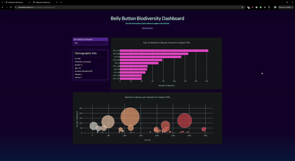

# ds_module_14_interactive_viz
Interactive Visualization Homework

## Libraries:
1. Bootstrap 5 (JS)
2. D3
3. Plotly
---

## Work Description:
1. Bootstrap was used to format a drop down menu, a dashboard, a horizontal bar chart, and a bubble chart
2. D3 was used to select various elements of the HTML to dynamically add new information to the web page; Both the Dashboard and dropdown menus were generated using D3
3. Plotly was used to create the horizontal bar chart and bubble chart
---
## Demonstration of Webpage

---

## Data Source
https://journals.plos.org/plosone/article?id=10.1371/journal.pone.0047712